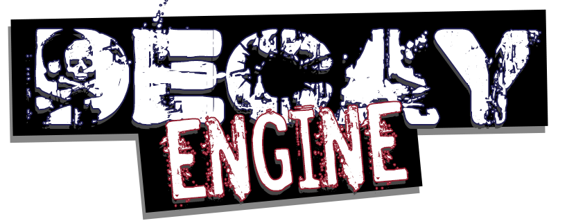

> [!CAUTION]
> ARCHIVE REPO FOR PRESERVATION PURPOSES  
> NOT IN DEVELOPMENT

----

<br />

<div style="text-align:center">
    
</div>

<br />
<br />

DecayEngine is a proprietary engine developed using .NET Core 3.1 that works on Windows (Win32 and UWP), Linux, Android, XBox, PS4, and Switch.  
The engine was internally developed by [@bilenkonito](https://github.com/bilenkonito) between 2019 and 2020 for usage in Rust Racers. The project is no longer maintained as development on Rust Racers switched to Unreal Engine 5.  
While the engine works on its current state, it is not fully feature-complete. A graphical editor was planned but never completed, so setting up projects requires manually writting `.meta` files for assets, baking them, and packing everything into `.decpak`/`.decmeta` bundles.  
Think of this repository as museum piece, rather than a live product.


> [!NOTE]
> For licensing reasons, files for XBox, PS4, and Switch are not contained in this repository.  

> [!NOTE]
> Due to the difficulty in stripping proprietary licensed code from the network sub-engine, those files are not contained in this repository.

## Table of contents

  * [Building](#building)
  * [Generating a Game Project](#generating-a-game-project)
  * [Generating a Typescript Typings](#generating-typescript-typings)
  * [Baking Assets](#baking-assets)
  * [Running](#running)
  * [Examples](#examples)

## Building

> [!NOTE]
> Make sure you have properly cloned all Git Submodules!

> [!WARNING]
> Some libraries cannot be included in this repository for licensing reasons.  
> Carefuly read the following instructions before building for the first time:
>  * FMod
>    * [DecayEngine.Fmod.Android](Engines/DecayEngine.Fmod/DecayEngine.Fmod.Android/README.md)
>    * [DecayEngine.Fmod.Desktop](Engines/DecayEngine.Fmod/DecayEngine.Fmod.Desktop/README.md)
>    * [DecayEngine.Fmod.WinRT](Engines/DecayEngine.Fmod/DecayEngine.Fmod.WinRT/README.md)
>  * SDL2
>    * [DecayEngine.SDL2.Android.Bindings](Engines/DecayEngine.SDL2/DecayEngine.SDL2.Android.Bindings/README.md)
>    * [DecayEngine.SDL2.Desktop](Engines/DecayEngine.SDL2/DecayEngine.SDL2.Desktop/README.md)

DecayEngine is built using [NUKE](https://nuke.build/).  
You can build the project using the provided script for your host platform (your development machine or CI/CD container).  
The build scripts provide shell completions for PowerShell and Bash, as well as a help text.

Windows
```ps1
& .\build.ps1 --help
```

Linux
```bash
./build.sh --help
```

From this point onwards, all command examples in this document will assume the host machine is running Windows 10 and using PowerShell, and that commands are being run from the base directory of the build artifact (the `target` folder by default).

## Generating a Game Project

A new Game Project skelleton can be generated by running the following command:

```ps1
& .\Tools\ResourceBuilder\DecayEngine.ResourceBuilder.exe new -h .\GameProject
```

## Generating Typescript Typings

Typings for the Game Project can be generated by running the following command:

```ps1
& .\Tools\TypingsGenerator\DecayEngine.TypingsGenerator.exe -o .\GameProject
```

You can see an example of these typings at [global.d.ts](examples/TestGameProject/global.d.ts).

## Baking Assets

Baking all assets from the `GameProject` folder, outputting the results to the `Data` folder can be achieved by running the following command:

```ps1
& .\Tools\ResourceBuilder\DecayEngine.ResourceBuilder.exe build -i .\GameProject -o .\Data -p Desktop
```

## Running

Running the `test_drivable_car_scene` scene on the `Desktop` platform can be achieved by running the following command:

```ps1
& .\DecayEngine.Standalone.exe -b .\Data\Desktop\Resources.decmeta -s 'test_drivable_car_scene'
```

## Examples

Examples for most features can be found in the provided [TestGameProject](examples/TestGameProject).
